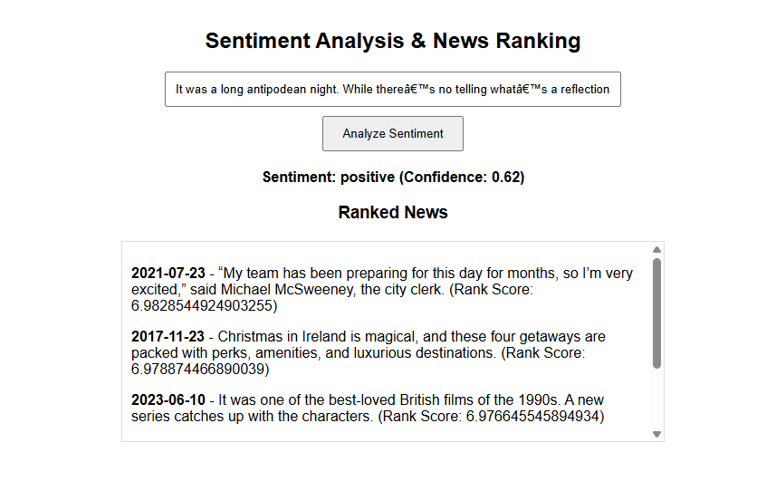

# News Ranking System

This project analyzes financial news with the aim of improving the decision-making process for investors. An LSTM model was built to classify news as positive or negative, and a ranking system was developed to process the latest news and rank the best stocks to invest in. A user interface was also created to interact with the model and display the top five most influential news items.

**Key Features:**

- **NLP:** An LSTM model was built to classify news as positive or negative.
- **Ranking News Pipeline:** A pipeline was developed to read data, analyze it, and provide the most impactful news.
- **FastAPI:** FastAPI was used for backend development.
- **User Interface:** A user interface was created to interact with the model and display the top 5 most influential news items.

**Prerequisites:**  
1. Python (>=3.8)  
2. Visual Studio Code

**Instructions:**  
1. Install dependencies using:  
   ```bash
   pip install -r requirements.txt
   ```
   
2. Open the UI in a browser using:  
   [http://127.0.0.1:8000](http://127.0.0.1:8000)


## Project Structure
```bash
├── assets/                 
│   └── ui.png                     # UI image file
├── config/
│   └── config.yaml                # Configuration file
├── data/
│   └── news.csv                   # Dataset containing news data
├── model/
│   ├── label_encoder.pkl          # Label encoder for sentiment classification
│   ├── sentiment_model.h5         # Trained sentiment analysis model
│   └── tokenizer.pkl              # Tokenizer for text preprocessing
├── notebook/
│   └── news-sentiment-analysis.ipynb  # Jupyter notebook for analysis
├── src/
│   ├── api/
│   │   ├── template/
│   │   │   └── interface.html     # HTML template for the UI
│   │   ├── api.py                 # Backend API logic
│   │   └── __init__.py            # Initialization for the api module
│   ├── model/
│   │   ├── sentimentModel.py      # Model logic for sentiment analysis
│   │   └── __init__.py            # Initialization for the model module
│   ├── config/
│   │   ├── configLoader.py        # Config loader for reading configuration
│   │   └── __init__.py            # Initialization for the config module
│   └── rankingSystem/
│       ├── rankingSystemPipeline.py # Pipeline for ranking news
│       └── __init__.py            # Initialization for the ranking system module
├── main.py                       # Main application file
└── requirements.txt              # List of required dependencies
```
## UI

